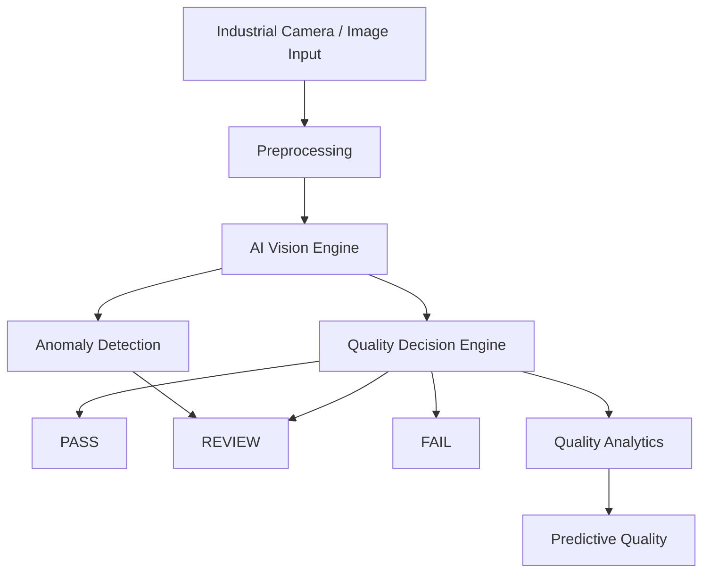

# AI Mudguard Quality Inspection

## Project Title
AI Quality Intelligence & Closed-Loop Vision Inspection System for Automotive Mudguards

## Project Objective
Develop a real‑time, production‑grade computer‑vision system that automatically detects, classifies, and localizes manufacturing defects in automotive mudguards, providing confidence scores, severity assessments, and actionable quality decisions.

## Known Defect Classes
- Scratch
- Dent
- Paint Defect
- Paint Misalignment

## Current Dataset Status
- **Training images**: 54
- **Validation images**: 10
- **Total images**: 64
- No annotations are currently provided. The dataset will be audited to determine the appropriate task type (classification, detection, segmentation, or anomaly detection).

## Planned System Capabilities
- Defect detection & classification
- Defect localization
- Confidence scoring & false‑positive/negative analysis
- Severity assessment & PASS/REVIEW/FAIL decisions
- Unknown defect / anomaly detection
- Human‑in‑the‑loop feedback loop
- Quality analytics & batch traceability
- Predictive quality analysis
- Real‑time, low‑latency inference (edge‑ready)
- Multi‑camera & PLC integration (future)

## High‑Level Architecture

## Folder Structure Explanation
- **data/** – Raw, processed, and split datasets plus sample images.
- **annotations/** – Annotation files for each data split.
- **configs/** – YAML configuration files (dataset, model, inference).
- **src/** – Core Python package containing modules for data handling, preprocessing, training, evaluation, inference, anomaly detection, quality decision, predictive analytics, and utilities.
- **models/** – Checkpoints, exported models, and best‑performing weights.
- **notebooks/** – Exploratory Jupyter notebooks.
- **dashboard/** – Front‑end visualization and analytics (future Streamlit/React).
- **api/** – FastAPI backend (future).
- **tests/** – Unit and integration tests.
- **outputs/** – Model predictions, metrics, visualizations, and reports.
- **logs/** – Application and training logs.
- **docs/** – Architecture, dataset, model, and deployment documentation.
- **scripts/** – Helper scripts for data download, preprocessing, etc.
- **run.py** – Entry point for training/inference pipelines.
- **requirements.txt / requirements-dev.txt** – Dependency lists.
- **pyproject.toml** – Build configuration.

## Development Phases
1. **Dataset Audit & Annotation** – Verify task type, create proper annotation format.
2. **Data Management & Preprocessing** – Build dataset loaders, augmentations.
3. **Model Selection & Training** – Experiment with YOYO‑compatible detectors.
4. **Evaluation & Metrics** – Implement comprehensive metrics and confusion analysis.
5. **Inference Engine** – Real‑time image/video pipelines.
6. **Anomaly Detection & Quality Decision** – Rule‑based and ML‑based severity scoring.
7. **Analytics & Predictive Quality** – Historical analysis and forecasting.
8. **API & Dashboard** – Deploy FastAPI service and UI.
9. **Edge Deployment** – Optimize for ONNX/TensorRT and integrate with PLC.

## Current Status
- Project skeleton created.
- Dataset files placed under `data/` (no annotations yet).
- Configuration placeholders defined.

## Important Limitations
- **Model architecture is TBD** – Will be decided after dataset audit.
- **No annotations** – Cannot train detection/segmentation models yet.
- **No data preprocessing pipelines** – To be implemented.
- **No API or UI** – Planned for later phases.

> **Note**: *Model architecture will be finalized only after dataset inspection and annotation‑format verification.*
